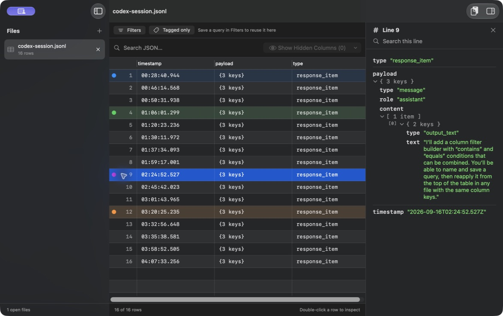

  

# Glade

A native macOS app for exploring `.jsonl`, `.ndjson`, and `.json` files.

[Download Glade](https://github.com/alxrod/glade/releases/latest) · macOS 14+ · Apple silicon & Intel

- **A workspace for logs:** files on the left, spreadsheet rows in the middle, and full JSON on the right. Double-click any row to inspect it.
- **Smarter columns:** timestamps first, readable text next, sparse fields last. Shared timestamp components collapse in the table; the inspector keeps the original value.
- **Your layout, remembered:** drag, resize, or hide columns. Files with the same keys reuse your layout.
- **Search and saved queries:** search whole files or one record, combine column “contains” and “equals” conditions, and save queries for matching schemas. Press Return to search.
- **Color tags:** highlight individual rows or a multi-row selection, filter to tagged rows, and pick up where you left off when you reopen a file.
- **Local file nicknames:** assign aliases without renaming your files.
- **Smooth native tables and automatic updates:** cached row previews, a compact toolbar, and release, beta, or alpha update channels.

*Sanitized excerpts from the Codex session used to build Glade. [Open the example log](sample-files/codex-session.jsonl).*

To build: copy `app/Glade/Local.xcconfig.example` to `Local.xcconfig` in the same folder, set your Apple development team, then open `app/Glade/Glade.xcodeproj` in Xcode. Run model tests with `swift test`. [Release instructions](docs/releasing.md).

Based on [Parsely](https://github.com/productengineered/parsely). [MIT license](LICENSE).

The Glade logo is inspired by the style of Sabra Field.
